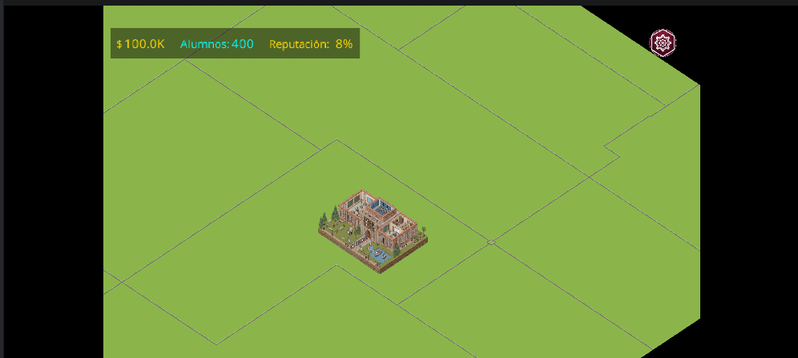
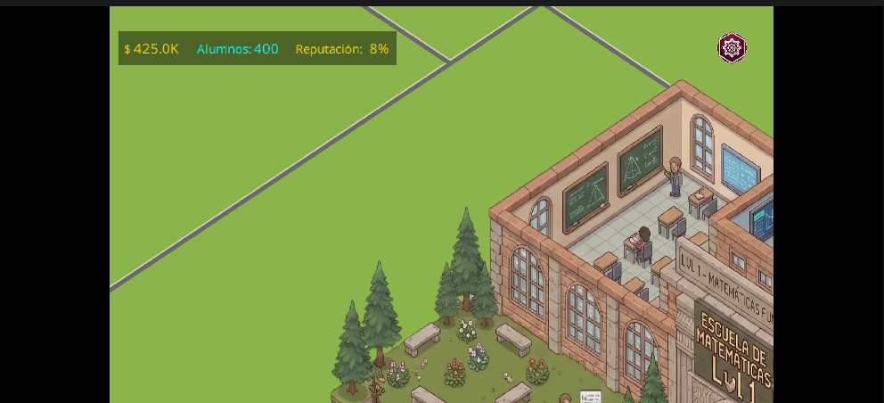
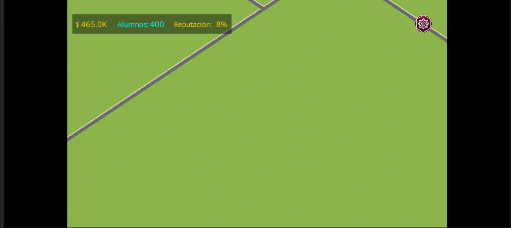
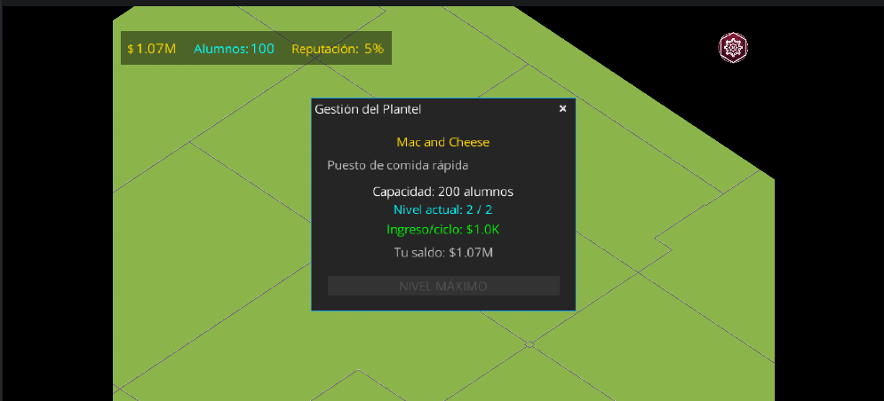
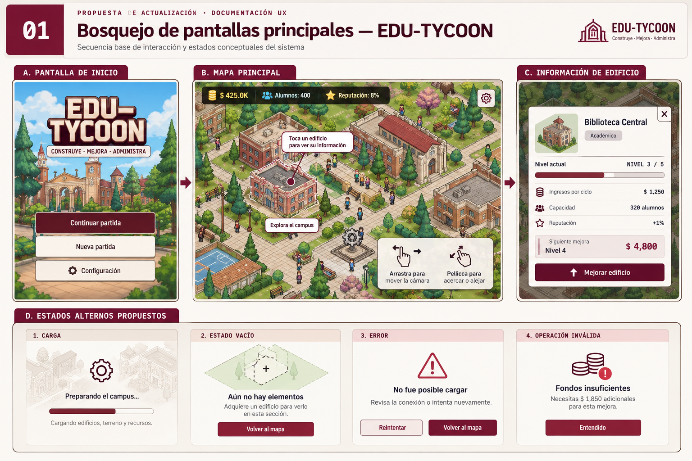
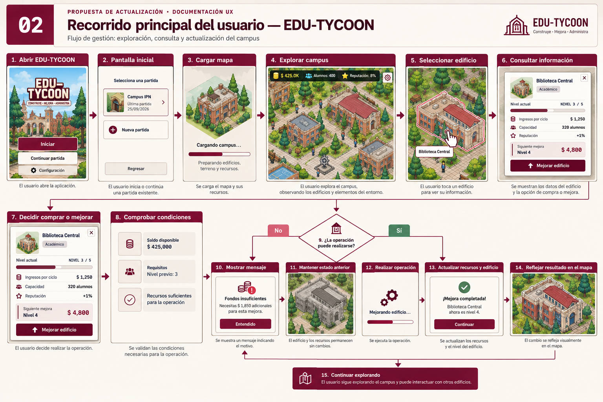
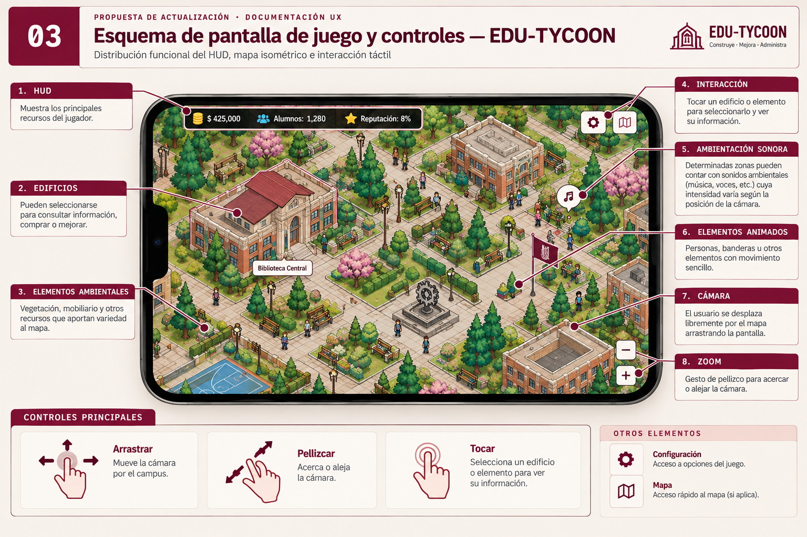

# Idea original — Actualización de EDU-TYCOON

## 1. Ruta elegida

**Ruta:** EduTycoon

El equipo eligió trabajar sobre EduTycoon con el propósito de actualizar una
aplicación existente, conservando sus mecánicas principales de gestión y
centrando el proyecto en la presentación e interacción dentro del mapa.

## 2. Motivo de elección

El 25 de septiembre de 2026 se realizó una prueba exploratoria para conocer el
funcionamiento del juego e identificar áreas de oportunidad.

Durante la prueba se encontró un mapa con poca actividad visual y sin
ambientación sonora. También se detectaron comportamientos gráficos
inconsistentes, particularmente al utilizar el zoom y al representar algunos
elementos adquiridos.

A partir de estos resultados se decidió trabajar sobre el entorno del juego,
incorporando mayor variedad visual, animaciones y sonido, además de corregir
los problemas detectados.

## 3. Usuario y contexto

El usuario objetivo es un jugador de EduTycoon, principalmente una persona
perteneciente o familiarizada con la comunidad del Instituto Politécnico
Nacional.

El juego se utiliza en dispositivos Android y permite administrar recursos para
adquirir y mejorar diferentes edificios del campus.

La propuesta se enfoca en el momento en que el jugador explora el mapa,
interactúa con los edificios y observa el desarrollo de su campus.

## 4. Problema observable

Actualmente, el mapa ofrece poca retroalimentación sobre la actividad y
evolución del campus. Existen grandes áreas con pocos elementos ambientales,
los edificios permanecen mayormente estáticos y no existe un entorno sonoro
que acompañe la exploración.

También se identificaron problemas gráficos que afectan la representación del
estado del juego.

### Problema en una frase

> El mapa de EduTycoon comunica de forma limitada la actividad y evolución del
> campus debido a su escasa variedad ambiental, ausencia de sonido y algunos
> problemas de representación gráfica.

## 5. Evidencia

### Prueba exploratoria

**Fecha:** 25 de septiembre de 2026.

**Método:** ejecución y exploración directa de EduTycoon, interactuando con el
mapa, edificios, mecánicas de adquisición y controles de cámara.

Durante la prueba se identificaron los siguientes puntos:

- poca actividad y variedad ambiental dentro del mapa;
- ausencia de ambientación sonora durante la exploración;
- cambio poco natural en la representación de los edificios al alejar la cámara;
- elementos adquiridos cuya representación gráfica no aparece correctamente.

Uno de los casos observados corresponde a Mac and Cheese. El juego registra el
establecimiento y permite consultar su información y nivel, pero su recurso
gráfico no aparece correctamente sobre el mapa.

### Evidencia visual

El 4 de octubre de 2026 se ejecutó nuevamente el proyecto para reproducir los
comportamientos identificados y obtener evidencia del estado actual.

#### Estado actual del mapa

**Figura 1.** Vista general del mapa de EduTycoon. Se observan amplias áreas
con pocos elementos ambientales y escasa actividad visual. 

#### Comportamiento durante el zoom

**Figura 2.** Representación de un edificio antes de alejar la cámara.

**Figura 3.** Representación del mismo entorno después de modificar el nivel
de zoom. La prueba permitió identificar un comportamiento inconsistente en la
visualización de los edificios. 

#### Problema de representación de Mac and Cheese

**Figura 4.** El juego registra Mac and Cheese en nivel 2/2; sin embargo, su
recurso gráfico no aparece correctamente sobre el mapa.

## 6. Alternativa actual

La alternativa actual consiste en utilizar EduTycoon con la presentación
existente. Las mecánicas permiten administrar recursos, adquirir edificios y
desarrollar el campus, pero la representación del entorno ofrece pocos
elementos que comuniquen actividad más allá de los edificios colocados.

La propuesta conserva estas mecánicas y trabaja principalmente sobre la manera
en que su resultado se presenta dentro del mapa.

## 7. Tarea principal

El jugador administra los recursos disponibles para adquirir y mejorar
edificios, desarrollando progresivamente el campus y consultando su estado
desde el mapa.

## 8. Propuesta

Se propone renovar el entorno de EduTycoon manteniendo su funcionamiento
principal.

El trabajo se divide en cuatro áreas:

### Correcciones gráficas

Corregir los problemas detectados en la representación de edificios y recursos,
incluyendo el comportamiento de su escala durante el zoom.

### Entorno

Agregar mayor variedad al escenario mediante mejoras en edificios, terreno y
elementos decorativos que permitan diferenciar mejor las distintas áreas del
campus.

### Animaciones

Incorporar movimiento en edificios y elementos ambientales mediante recursos
como personas, banderas u otros objetos relacionados con cada zona.

Las animaciones podrán variar de acuerdo con el edificio y su estado para
evitar que el escenario permanezca completamente estático.

### Sonido

Incorporar música y sonidos ambientales. Algunas zonas o edificios podrán
contar con ambientes propios cuya intensidad varíe gradualmente según la
posición de la cámara.

## 9. Material visual de la propuesta

Los siguientes bocetos representan de manera conceptual la dirección planteada
para la actualización de EduTycoon. Su objetivo es comunicar la organización
de las pantallas, el recorrido principal del jugador y los elementos que se
consideran para la pantalla de juego.

Las imágenes no representan una especificación exacta de la interfaz final.
Algunos edificios, elementos ambientales, cantidades, nombres y recursos
gráficos son ilustrativos y podrán cambiar durante la implementación.

La propuesta conservará como base la interfaz y las mecánicas existentes de
EduTycoon. La implementación se concentrará principalmente en el mapa y se
realizará inicialmente sobre zonas seleccionadas antes de extender las mejoras
a otros sectores.

### 9.1 Bosquejo de pantallas principales

**Figura 5. Bosquejo conceptual de las pantallas principales.**
Representa la relación entre la pantalla inicial, la exploración del mapa y la
consulta de información de un edificio. También presenta de forma conceptual
estados alternos de carga, ausencia de contenido, error y operación inválida.

Elaborado por el equipo con apoyo de ChatGPT para la generación del boceto
visual. El contenido y su correspondencia con la propuesta fueron revisados por
el equipo.

### 9.2 Recorrido principal del usuario

**Figura 6. Recorrido principal del usuario.**
Representa el flujo desde el inicio de EduTycoon hasta la exploración del
campus, selección de un edificio y ejecución de una operación. El recorrido
también contempla el caso en que las condiciones necesarias no se cumplen y
la operación debe rechazarse sin modificar el estado anterior.

Elaborado por el equipo con apoyo de ChatGPT para la generación del boceto
visual. El flujo fue definido y revisado por el equipo.

### 9.3 Esquema de pantalla de juego y controles

**Figura 7. Esquema conceptual de la pantalla de juego y sus controles.**
Identifica los principales componentes considerados durante la exploración del
campus: HUD, edificios, elementos ambientales, elementos animados,
ambientación sonora, desplazamiento de cámara, zoom e interacción mediante
toque.

Los elementos mostrados representan una dirección de diseño y no implican que
la totalidad del mapa deba alcanzar este nivel de detalle durante la primera
versión.

Elaborado por el equipo con apoyo de ChatGPT para la generación del boceto
visual. La distribución y los elementos representados fueron revisados por el
equipo.

## 10. Criterio de éxito

La propuesta se considerará satisfactoria cuando las zonas actualizadas
permitan comprobar que:

1. los recursos adquiridos se representan correctamente;
2. los edificios mantienen una escala coherente durante el uso del zoom;
3. existen elementos ambientales y animados visibles durante la exploración;
4. se reproduce sonido durante la partida;
5. los ambientes asociados a zonas específicas realizan transiciones graduales
   durante el desplazamiento por el mapa.

## 11. Alcance de la primera versión

La primera versión contempla:

- corregir los problemas gráficos identificados;
- ajustar el comportamiento de los edificios durante el zoom;
- renovar edificios y elementos seleccionados del mapa;
- incorporar elementos decorativos al terreno;
- añadir animaciones sencillas;
- implementar música y sonidos ambientales;
- crear ambientes sonoros para determinadas zonas;
- realizar transiciones de audio basadas en la posición de la cámara.

La implementación comenzará sobre zonas seleccionadas del mapa para validar las
soluciones antes de extenderlas a otros sectores.

## 12. Funciones aplazadas

Quedan fuera del alcance de esta versión:

- rediseño completo del sistema económico;
- nuevas mecánicas principales de administración;
- multijugador;
- servicios en línea adicionales;
- creación de nuevas zonas completas del campus;
- sistemas complejos de inteligencia artificial o desplazamiento autónomo de
  personajes.

El proyecto se concentrará en mejorar el contenido y comportamiento del entorno
existente antes de considerar nuevas mecánicas de mayor alcance.

## 13. Hipótesis pendiente de validar

> Incorporar mayor actividad al mapa mediante elementos ambientales,
> animaciones y sonido permitirá que el jugador identifique mejor los cambios
> del campus y perciba un entorno más dinámico durante la partida.

Los problemas iniciales ya fueron observados directamente; lo que permanece
pendiente de validar es el efecto que tendrán las modificaciones propuestas
sobre la percepción de los jugadores.

## 14. Historia de usuario

> **Como jugador de EduTycoon, quiero observar y escuchar cambios en el entorno
> mientras desarrollo el campus, para identificar mejor el resultado de mis
> acciones y percibir un mapa más dinámico.**

---

## 15. Criterio de aceptación

> **Dado** que el jugador se encuentra explorando el campus y existen edificios
> adquiridos, **cuando** se desplaza por una zona actualizada e interactúa con
> la cámara, **entonces** los edificios deben permanecer representados
> correctamente y deben mostrarse los elementos ambientales y animaciones
> correspondientes, acompañados por el sonido configurado para esa zona.

---

## 16. Uso de inteligencia artificial

Se utilizó ChatGPT como herramienta de apoyo para organizar y redactar la
documentación del proyecto.

El equipo revisa y valida el contenido antes de incorporarlo al repositorio.